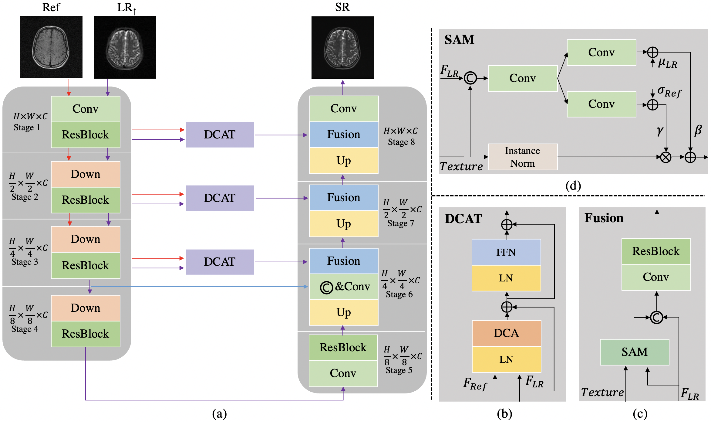

# Accurate multi-contrast MRI super-resolution via a dual cross-attention transformer network (DCAMSR)

<div align="center">
  
</div>

# News
## 2023.2.3 here we are 🪧🪧🪧
## 2023.5.24 Early Accepted By MICCAI2023 🎆🎆🎆

## Dependencies
* numpy==1.18.5
* scikit_image==0.16.2
* torchvision==0.8.1
* torch==1.7.0
* runstats==1.8.0
* pytorch_lightning==0.9.0
* h5py==2.10.0
* PyYAML==5.4
* timm
* einops
* python-opencv

## Data:
The data used for the image super-resolution task comes from the [fastMRI dataset](https://github.com/facebookresearch/fastMRI) and [M4Raw](https://github.com/mylyu/M4Raw).

The multi-contrast MR images csv file is released in dataset fold. fastMRI csv file comes from [MINet](https://github.com/chunmeifeng/MINet).

Within each task folder, the following structure is expected:
```
    data0/fastmri_knee
    ├── singlecoil_train
    │   ├── xxx.h5
    │   ├── ...
    ├── singlecoil_val
    │   ├── xxx.h5
    │   ├── ...
```
```
    data0/M4RawV1.1
    ├── multicoil_train
    │   ├── xxx.h5
    │   ├── ...
    ├── multicoil_val
    │   ├── xxx.h5
    │   ├── ...
```

# Code Usage
## Install
```bash
pip install -r requirement.txt
```

## Training
```bash
cd experimental/DCAMSR
python train.py
```

## Evaluation
```bash
cd experimental/DCAMSR
python test.py --mode test --resume xxx
```

## weight release


## Acknowledgement 
We borrow some codes from [MASA](https://github.com/dvlab-research/MASA-SR) and [MINet](https://github.com/chunmeifeng/MINet). We thank the authors for their great work.
